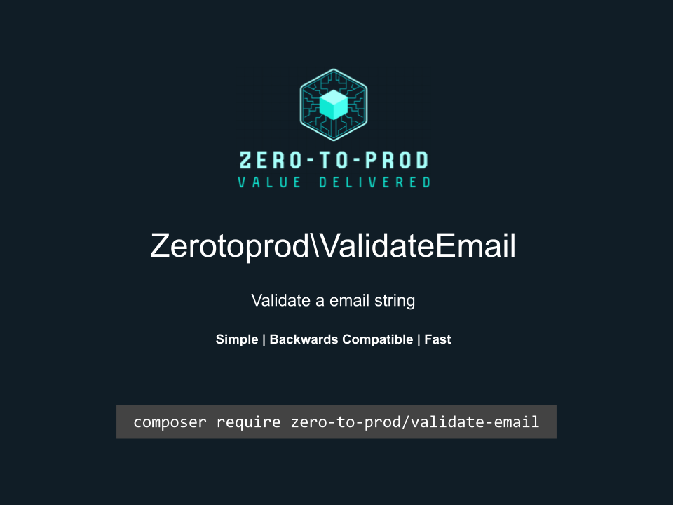

# Zerotoprod\ValidateEmail



[](https://github.com/zero-to-prod/validate-email)
[](https://github.com/zero-to-prod/validate-email/actions)
[](https://packagist.org/packages/zero-to-prod/validate-email/stats)
[](https://packagist.org/packages/zero-to-prod/validate-email/stats)
[](https://packagist.org/packages/zero-to-prod/validate-email)
[](https://github.com/zero-to-prod/validate-email/blob/main/LICENSE.md)

Validates an email.

## Installation

Install the package via Composer:

```bash
composer require zero-to-prod/validate-email
```

## Usage

Returns true if the value is a valid email.

```php
Zerotoprod\ValidateEmail\ValidateEmail::isEmail('john@example.com')
```